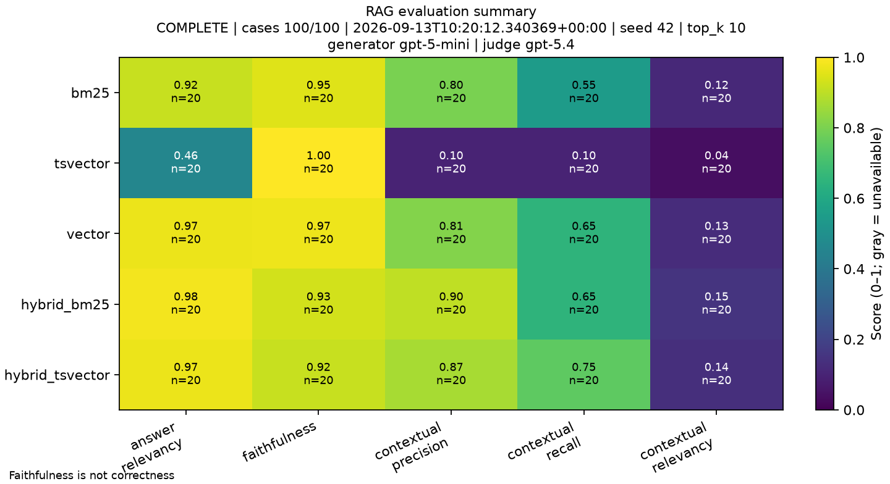

# rag-eval

A rag system with comprehensive eval + observability

## Getting Started

### Database (PostgreSQL + ParadeDB)

The repository uses ParadeDB's official PostgreSQL 18 image, which includes
both `pgvector` and the `pg_search` extension. No host-level PostgreSQL
extensions need to be installed.

For a fresh checkout, start PostgreSQL from the repository root:

```bash
docker compose up -d postgres
```

On first initialization, ParadeDB's bootstrap creates the `vector`, `pg_search`,
and related extensions, then the project init script creates `unaccent` in
`deep_agents_rag`. The Compose command keeps ParadeDB's required extensions in
`shared_preload_libraries`.

Verify the installation:

```bash
docker compose exec postgres \
  psql -U postgres -d deep_agents_rag \
  -c "SHOW shared_preload_libraries;"

docker compose exec postgres \
  psql -U postgres -d deep_agents_rag \
  -c "SELECT extname, extversion FROM pg_extension WHERE extname IN ('vector', 'pg_search', 'unaccent') ORDER BY extname;"
```

### Backend

1. Go to the `backend` directory.
2. Get `uv` if you don't have it already.
3. Copy the environment template, then replace placeholder values with your
   database URL and API keys:

   ```bash
   cp ../.env.example .env
   ```

   Edit `.env` and set `DATABASE_URL`, `OPENAI_API_KEY`, and `COHERE_API_KEY`.
   Optional RAG, evaluation, and LangSmith settings are included in the template.

4. Install dependencies:

   ```bash
   uv sync
   ```

5. Run the Alembic migrations to sync the database schema:

   ```bash
   uv run alembic upgrade head
   ```

6. Ingest the data:

   ```bash
   uv run ingest
   ```

7. Build the deduplicated, question-scoped passage corpus:

   ```bash
   uv run build-passages
   ```

8. Embed materialized passages with OpenAI:

   ```bash
   uv run embed-passages
   ```

The `hotpot_qa` table remains the raw evaluation data. The passage materializer
stores one unique normalized passage per identity in `source_passage`, while
`hotpot_qa_context` limits retrieval to the original question's context
candidates. `embed-passages` fills missing embeddings in resumable batches using
`text-embedding-3-small`; rerunning it skips passages that already have vectors.

### RAG evaluation

Run the offline test suite without paid calls:

```bash
cd backend
RUN_RAG_EVAL=0 uv run pytest -q
```

Run the opt-in live RAG evaluation after preparing the database, passages, and
embeddings:

```bash
RUN_RAG_EVAL=1 uv run pytest tests/test_rag.py -q
```

The live evaluation requires `DATABASE_URL`, `OPENAI_API_KEY`, and
`COHERE_API_KEY`. It evaluates the configured retriever graphs sequentially and
writes the JSON report to:

```text
backend/.rag-eval/results.json
```

The report contains per-case results and aggregate metrics under `summary`.

### Evaluation method

The evaluation uses [DeepEval](https://deepeval.com/) (`deepeval>=4.2.2`)
with the configured judge model as an LLM evaluator. Heatmaps use
[Matplotlib](https://matplotlib.org/) (`matplotlib>=3.11.2`) with its headless
Agg backend to write static PNGs.

Each score ranges from 0 to 1; higher is better:

| Metric | What it measures |
| --- | --- |
| Answer relevancy | Whether generated answer stays relevant to the question. Measures answer focus, not factual correctness. |
| Faithfulness | Whether claims in generated answer are supported by retrieved context. Measures grounding, not truth outside retrieved context. |
| Contextual precision | Whether relevant passages appear above irrelevant passages in the ranked retrieval results. Measures ranking and reranking quality. |
| Contextual recall | Whether retrieved passages contain the information needed to produce the expected answer. Measures retrieval completeness. |
| Contextual relevancy | How much of the retrieved context is relevant to the question. Measures retrieval signal-to-noise. |

The report stores per-case scores and retriever-level means. It does not combine
these metrics into one overall score.

### RAG evaluation summary



Snapshot generated from `backend/.rag-eval/results.json`. Regenerate it after
new evaluations with the offline heatmap command documented in
[`backend/README.md`](backend/README.md).

### HotpotQA passage sizing

Measured from the `hotpotqa/hotpot_qa` dataset using the `distractor` configuration across the train and validation splits. A passage is one context document with its sentences joined together; word counts use whitespace splitting.

- Average passage: ~89 words (~550 characters)
- Maximum passage: 1,378 words (7,903 characters)
- Average full question context: ~887 words across about 10 passages
- Maximum full question context: 2,792 words (17,526 characters)

Most passages do not need chunking. Keep context documents separate and chunk only oversized passages when required by the embedding model's input limit; avoid embedding the entire question context as one retrieval unit.
